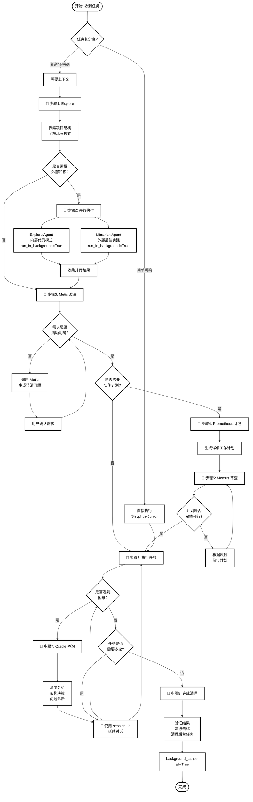

# OMO Agents 使用指南

> OhMyOpenCode 插件生态系统中的智能代理完全手册

## 📚 目录

- [概述](#概述)
- [专业 Agents](#专业-agents)
  - [Explore (探路者)](#explore-探路者)
  - [Prometheus (计划规划者)](#prometheus-计划规划者)
  - [Momus (计划审查者)](#momus-计划审查者)
  - [Oracle (架构师/智囊)](#oracle-架构师智囊)
  - [Librarian (图书管理员)](#librarian-图书管理员)
  - [Multimodal-Looker (视觉专家)](#multimodal-looker-视觉专家)
  - [Metis (预规划咨询)](#metis-预规划咨询)
  - [Sisyphus-Junior (专注执行者)](#sisyphus-junior-专注执行者)
- [通用 Agents](#通用-agents)
- [使用方法](#使用方法)
  - [基本调用模式](#基本调用模式)
  - [并行执行](#并行执行)
  - [会话延续](#会话延续)
  - [选择正确的 Agent](#选择正确的-agent)
- [最佳实践](#最佳实践)

---

## 概述

OMO (OhMyOpenCode) 是运行在 OpenCode (OC) AI 编程工具中的插件系统,提供多个专业化的智能代理来协助你完成各种编程任务。每个代理都基于 GLM-4.7 的强大能力,具有不同的专长和用途。

### 核心特性

- **204K 长上下文窗口**: 处理大型代码库和复杂文档
- **深度推理能力**: 复杂问题分析和决策
- **多模态支持**: 视觉、图表、PDF 分析
- **并行执行**: 同时运行多个代理提高效率
- **会话延续**: 保存上下文的多轮对话

---

## 专业 Agents

### Explore (探路者)

**能力**: 利用 GLM-4.7 的 204K 长上下文快速扫描项目结构和文件内容

#### 用途
- 发现关键代码模式
- 理解项目架构
- 查找特定功能的实现
- 识别代码风格和约定

#### 何时使用
- 需要理解现有代码库
- 查找某个功能在哪里实现
- 了解项目的整体结构
- "这个项目中 X 是如何实现的?"

#### 示例场景
```python
# 场景: 需要了解项目中的认证实现
delegate_task(
    subagent_type="explore",
    load_skills=[],
    prompt="""
    我需要理解这个项目中的用户认证系统是如何实现的。
    请找到:
    1. 认证相关的文件和模块
    2. 使用的认证策略 (JWT, Session, OAuth等)
    3. 中间件和路由保护机制
    4. 数据库中的用户模型
    """,
    run_in_background=True
)
```

#### 输出特点
- 代码结构总结
- 关键文件路径
- 实现模式说明
- 依赖关系图

---

### Prometheus (计划规划者)

**能力**: 利用 GLM-4.7 的深度推理能力生成详细的工作计划和任务分解

#### 用途
- 将大任务分解为可执行步骤
- 生成实施计划
- 识别任务依赖关系
- 估算工作量

#### 何时使用
- 实现复杂功能
- 重构大型模块
- 多步骤的系统升级
- "我需要实现 X,应该从哪里开始?"

#### 示例场景
```python
# 场景: 规划一个完整的用户系统实现
delegate_task(
    subagent_type="prometheus",
    load_skills=["writing-plans", "brainstorming"],
    prompt="""
    我需要为这个 Web 应用实现一个完整的用户管理系统,包括:
    - 用户注册和登录
    - 邮箱验证
    - 密码重置
    - 用户资料管理
    - 权限控制 (管理员/普通用户)

    请生成详细的实施计划,包括:
    1. 数据库模型设计
    2. API 端点规划
    3. 前端页面需求
    4. 安全考虑
    5. 测试策略
    6. 实施顺序和依赖关系
    """,
    run_in_background=False
)
```

#### 输出特点
- 结构化的任务列表
- 依赖关系说明
- 优先级排序
- 风险评估

---

### Momus (计划审查者)

**能力**: 利用 GLM-4.7 的深度推理能力严格验证工作计划的完整性、清晰度和可执行性

#### 用途
- 捕获计划中的技术差距
- 识别缺失的上下文
- 验证计划的可行性
- 提出改进建议

#### 何时使用
- 执行计划前进行质量检查
- 审查他人生成的实施计划
- "这个计划是否有遗漏?"
- 在开始大型任务前确保计划完整

#### 示例场景
```python
# 场景: 审查实施计划
delegate_task(
    subagent_type="momus",
    load_skills=[],
    prompt="""
    请审查以下实施计划:

    [在此处粘贴计划内容]

    检查:
    1. 计划是否完整?是否有遗漏的步骤?
    2. 任务之间的依赖关系是否清晰?
    3. 是否有技术上的不可行性?
    4. 是否需要更多的上下文信息?
    5. 有哪些潜在风险未被考虑?

    请提供详细的审查意见和改进建议。
    """,
    run_in_background=False
)
```

#### 输出特点
- 完整性检查报告
- 清晰度评分
- 可行性分析
- 具体改进建议

---

### Oracle (架构师/智囊)

**能力**: 利用 GLM-4.7 的 204K 超长上下文和深度推理能力,处理复杂架构设计、深层 Bug 分析和决策

#### 用途
- 架构设计和权衡
- 深度调试复杂问题
- 技术决策咨询
- 性能和安全性分析

#### 何时使用
- **多系统权衡决策**: 选择技术栈、架构模式
- **2+ 次修复失败**: 常规调试无效时
- **不熟悉的代码模式**: 需要深入理解
- **安全/性能关注**: 需要专家分析
- "这个架构设计是否合理?"
- "为什么这个 bug 一直修复不了?"

#### 示例场景
```python
# 场景: 架构设计咨询
delegate_task(
    subagent_type="oracle",
    load_skills=[],
    prompt="""
    我正在设计一个实时聊天应用,需要处理以下需求:
    - 支持 10,000+ 并发用户
    - 消息延迟 < 100ms
    - 持久化聊天历史
    - 离线消息推送

    当前考虑的方案:
    方案A: WebSocket + Redis + MongoDB
    方案B: Server-Sent Events + PostgreSQL

    请分析:
    1. 各方案的优劣
    2. 扩展性考虑
    3. 潜在瓶颈
    4. 推荐方案及理由
    """,
    run_in_background=False
)
```

#### 输出特点
- 深度技术分析
- 多方案对比
- 风险评估
- 专业推荐

---

### Librarian (图书管理员)

**能力**: 利用 GLM-4.7 的 204K 超长上下文窗口,快速查阅海量文档和代码库,精准定位所需信息

#### 用途
- 搜索官方文档
- 查找开源实现示例
- 学习最佳实践
- 理解库的使用方法

#### 何时使用
- **使用不熟悉的库/框架**
- **查找 API 文档**
- **学习某个功能的实现模式**
- "X 框架中如何实现 Y?"
- "这个库的最佳实践是什么?"

#### 示例场景
```python
# 场景: 学习 Express.js 认证最佳实践
delegate_task(
    subagent_type="librarian",
    load_skills=[],
    prompt="""
    我需要在 Express.js 中实现用户认证,希望了解:

    1. Express.js 中处理认证的推荐方式
    2. Passport.js 的使用模式
    3. JWT vs Session 的优劣
    4. 安全最佳实践 (CSRF, XSS 等)
    5. 生产环境的常见配置

    请查找官方文档和知名开源项目的实现示例。
    """,
    run_in_background=True
)
```

#### 输出特点
- 官方文档引用
- 代码示例
- 最佳实践总结
- 常见陷阱警告

---

### Multimodal-Looker (视觉专家)

**能力**: 利用 GLM-4.7 的多模态能力,快速分析图像、图表和 PDF 内容,提取关键信息

#### 用途
- 分析架构图
- 理解 UI 设计稿
- 提取 PDF 文档信息
- 解读技术图表

#### 何时使用
- 需要理解架构图/流程图
- 从设计稿提取需求
- 分析技术文档截图
- "这个架构图说明了什么?"

#### 示例场景
```python
# 场景: 分析架构图
delegate_task(
    subagent_type="multimodal-looker",
    load_skills=[],
    prompt="""
    请分析这张系统架构图,提取以下信息:
    1. 系统的主要组件
    2. 组件之间的交互关系
    3. 数据流向
    4. 潜在的单点故障
    5. 扩展性考虑

    图片路径: /path/to/architecture-diagram.png
    """,
    run_in_background=False
)
```

#### 输出特点
- 图表结构描述
- 关键信息提取
- 技术洞察
- 改进建议

---

### Metis (预规划咨询)

**能力**: 利用 GLM-4.7 的深度推理能力识别隐藏意图、检测模糊需求,生成澄清问题

#### 用途
- 识别需求中的模糊点
- 发现隐藏的技术依赖
- 生成澄清问题
- 防止 AI-slop 模式

#### 何时使用
- **需求不明确或复杂**
- **开始大型任务前**
- "在开始之前,我需要澄清几个点"
- 检测需求是否有遗漏

#### 示例场景
```python
# 场景: 需求澄清
delegate_task(
    subagent_type="metis",
    load_skills=[],
    prompt="""
    用户需求: "我要一个电商网站"

    请分析这个需求并生成澄清问题:
    1. 识别模糊或不完整的地方
    2. 发现隐藏的技术依赖
    3. 生成最多 5 个关键澄清问题
    4. 评估是否是 AI-slop 模式

    目标是确保我们完全理解用户意图后再开始规划。
    """,
    run_in_background=False
)
```

#### 输出特点
- 模糊点识别
- 关键澄清问题
- 隐含假设揭示
- 需求完整性评估

---

### Sisyphus-Junior (专注执行者)

**能力**: 与 Sisyphus 相同的纪律,不委托其他代理,专注完成具体任务

#### 用途
- 执行明确的编码任务
- 文件修改
- 代码重构
- 测试编写

#### 何时使用
- 任务明确,不需要额外规划
- 需要直接修改代码
- "把这个函数重构一下"
- "添加一个新的 API 端点"

#### 示例场景
```python
# 场景: 明确的代码修改
delegate_task(
    subagent_type="sisyphus-junior",
    load_skills=["test-driven-development"],
    prompt="""
    任务: 在 User 模型中添加 email 验证功能

    要求:
    1. 添加 email 字段的唯一性验证
    2. 添加格式验证 (regex)
    3. 编写单元测试
    4. 遵循项目现有的代码风格

    文件路径: /src/models/User.ts
    """,
    run_in_background=False
)
```

#### 输出特点
- 直接的代码修改
- 遵循现有模式
- 测试覆盖
- 验证通过

---

## 通用 Agents

### Build (默认代理)

**用途**: 执行基于配置权限的工具,适合大多数常规任务

**何时使用**:
- 默认选择
- 不需要特殊能力的任务
- 常规代码操作

### Plan (计划模式)

**特点**: 禁用所有编辑工具,只允许只读操作

**何时使用**:
- 需要探索但不修改
- 分析代码库
- 生成报告

### General (通用代理)

**用途**: 处理复杂多步骤任务的通用目的代理

**何时使用**:
- 跨多个领域的工作
- 不适合专业代理的任务
- 需要灵活性的场景

---

## 使用方法

### 基本调用模式

```python
delegate_task(
    # 必需参数
    subagent_type="agent_name",        # 代理类型
    load_skills=["skill1", "skill2"],  # 要加载的技能 (至少一个)
    prompt="详细描述任务...",          # 任务描述
    run_in_background=False,           # 是否异步运行

    # 可选参数
    session_id="ses_abc123",           # 继续已有会话
    description="简短任务描述"         # 任务简述
)
```

### 并行执行 (推荐)

对于**独立任务**,使用后台模式并行执行可大幅提高效率:

```python
# 同时启动多个探索任务
task1 = delegate_task(
    subagent_type="explore",
    load_skills=[],
    prompt="查找项目中的认证实现模式",
    run_in_background=True
)

task2 = delegate_task(
    subagent_type="librarian",
    load_skills=[],
    prompt="查找 Express 认证最佳实践",
    run_in_background=True
)

# 继续其他工作...

# 稍后收集结果
result1 = background_output(task_id=task1)
result2 = background_output(task_id=task2)

# 记得取消所有后台任务
background_cancel(all=True)
```

**何时使用并行**:
- 2+ 个独立任务
- 任务间无共享状态
- 任务间无顺序依赖
- 节省时间很重要

### 会话延续

使用返回的 `session_id` 继续对话,保留完整上下文:

```python
# 第一次调用
response = delegate_task(
    subagent_type="oracle",
    load_skills=[],
    prompt="分析这个架构设计...",
    run_in_background=False
)
session_id = response.get("session_id")

# 后续补充问题
delegate_task(
    session_id=session_id,
    prompt="补充: 考虑到成本因素,方案A是否还有优势?"
)

# 修复问题
delegate_task(
    session_id=session_id,
    prompt="Fix: 第3点的分析有误,实际数据是..."
)
```

**为什么使用 session_id**:
- 保存完整对话上下文
- 避免重复文件读取
- 节省 70%+ token
- 代理知道之前尝试过什么

---

## 选择正确的 Agent

### 决策树

```
你的任务是什么?
│
├─ 需要理解代码库结构?
│  └─ → Explore
│
├─ 需要外部文档或开源示例?
│  └─ → Librarian
│
├─ 需要生成实施计划?
│  └─ → Prometheus
│
├─ 需要审查计划质量?
│  └─ → Momus
│
├─ 需求不明确需要澄清?
│  └─ → Metis
│
├─ 架构设计/深层调试?
│  └─ → Oracle
│
├─ 分析图像/PDF/图表?
│  └─ → Multimodal-Looker
│
└─ 明确的代码修改任务?
   └─ → Sisyphus-Junior
```

### 快速参考表

| 任务类型 | 推荐代理 | 复杂度 | 成本 |
|---------|---------|-------|------|
| 理解代码结构 | `explore` | 低-中 | 免费 |
| 外部库文档查询 | `librarian` | 低-中 | 便宜 |
| 生成实施计划 | `prometheus` | 高 | 昂贵 |
| 审查计划质量 | `momus` | 高 | 昂贵 |
| 需求澄清 | `metis` | 中 | 昂贵 |
| 架构决策 | `oracle` | 高 | 昂贵 |
| 深度调试 | `oracle` | 高 | 昂贵 |
| 分析视觉资料 | `multimodal-looker` | 中 | - |
| 明确代码修改 | `sisyphus-junior` | 低-中 | - |

---

## 最佳实践

### 工作流程图



### 最佳实践要点

#### 1. 从 Explore 开始 📍
在开始任何工作前,先让 Explore 了解项目结构和现有模式。

**为什么?**
- 避免重复造轮子
- 遵循现有代码风格
- 发现隐藏的依赖关系

#### 2. 并行使用 Explore + Librarian 📍
- **Explore**: 内部代码模式
- **Librarian**: 外部最佳实践

**为什么并行?**
- 节省 50%+ 等待时间
- 内外部知识互补
- 趁等待时间做其他工作

#### 3. 复杂任务咨询 Oracle 📍
不要在复杂问题上挣扎,Oracle 是为解决难题而存在的。

**何时咨询?**
- 架构设计决策
- 2+ 次修复失败
- 不熟悉的代码模式
- 安全/性能关注

#### 4. 计划前用 Metis 澄清 📍
防止因理解偏差导致的返工。

**成本收益分析**:
- 澄清时间: 5-10 分钟
- 返工成本: 2-4 小时
- **ROI**: 节省 95%+ 潜在返工时间

#### 5. 大计划用 Momus 审查 📍
在执行前确保计划完整可行。

**审查清单**:
- [ ] 计划是否完整?
- [ ] 依赖关系是否清晰?
- [ ] 是否有技术风险?
- [ ] 是否需要更多上下文?

#### 6. 使用 session_id 延续对话 📍
节省 token,保持上下文。

**性能对比**:
```
不使用 session_id:  每轮 10K tokens
使用 session_id:    每轮 3K tokens
节省:               70% token 成本
```

#### 7. 后台任务记得清理 📍
完成后使用 `background_cancel(all=True)`。

**为什么重要?**
- 释放系统资源
- 避免内存泄漏
- 保持系统整洁

#### 8. 明确任务再委托 📍
Sisyphus-Junior 需要清晰的指令,模糊的任务先用 Metis 澄清。

**好的任务描述**:
```
✅ 在 User.ts 第42行添加 email 验证
   - 格式: 正则表达式
   - 测试: 3个单元测试
   - 风格: 遵循现有代码
```

**模糊的任务描述**:
```
❌ 优化用户认证
```

### 快速决策表

| 场景 | 推荐流程 | 关键代理 |
|------|---------|---------|
| 简单 bug 修复 | 直接执行 | Sisyphus-Junior |
| 新功能开发 | Explore → Librarian → Metis → Prometheus → Momus → 执行 | 全流程 |
| 架构重构 | Explore → Oracle → Prometheus → Momus → 执行 | Oracle 为主 |
| 学习新技术 | Librarian → Explore | Librarian 为主 |
| 深度调试 | Explore → (2次失败) → Oracle | Oracle |
| 需求不明确 | Metis → 确认 → 计划 | Metis |

---

## 附录: 技能 (Skills) 系统

除了代理类型,OMO 还通过 `load_skills` 参数注入专业领域知识。

### 常用技能

| 技能名称 | 用途 |
|---------|------|
| `playwright` | 浏览器自动化任务 (必需) |
| `git-master` | Git 操作 (必需) |
| `test-driven-development` | TDD 开发流程 |
| `systematic-debugging` | 系统化调试 |
| `brainstorming` | 创意工作前的头脑风暴 |
| `writing-plans` | 编写实施计划 |
| `verification-before-completion` | 完成前验证 |

### 技能使用原则

**MANDATORY**: 必须为每个委托任务加载至少一个相关技能。

```python
# ✅ 正确: 加载相关技能
delegate_task(
    subagent_type="explore",
    load_skills=["git-master"],  # 相关技能
    prompt="..."
)

# ❌ 错误: 空技能列表 (无正当理由)
delegate_task(
    subagent_type="explore",
    load_skills=[],  # 空列表!
    prompt="..."
)
```

**选择技能的步骤**:
1. 阅读所有技能描述
2. 检查技能领域是否与任务重叠
3. 包含所有相关技能
4. 如果省略某个可能相关的技能,必须提供理由

---

## 总结

OMO 的代理系统提供了强大的工具集来处理各种编程任务:

- **理解代码**: Explore
- **学习外部知识**: Librarian
- **规划工作**: Prometheus + Momus
- **澄清需求**: Metis
- **解决难题**: Oracle
- **分析视觉资料**: Multimodal-Looker
- **执行任务**: Sisyphus-Junior

**关键原则**:
1. 使用正确的代理做正确的事
2. 并行执行独立任务
3. 保留会话上下文
4. 复杂问题不要独自解决
5. 总是加载相关技能

---

*文档版本: 1.0*
*最后更新: 2026-02-05*
*基于: OhMyOpenCode Plugin System*
